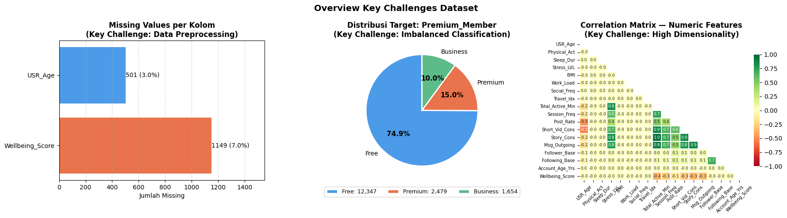

# 📱 Digital Wellbeing & Subscription Conversion Analysis

> Exploratory analysis of user behavior on an Instagram-like platform to uncover behavioral drivers of mental wellbeing and subscription conversion potential.

---

## 📌 Background

In the digital media industry, platforms need to deeply understand user behavior and wellbeing before designing monetization strategies. Poorly targeted subscription promotions lead to wasted marketing budgets and operational costs — especially when focused on segments prone to churn.

This project simulates the role of a **data science team at a tech company**, tasked with analyzing user behavior patterns to support strategic decision-making that balances **revenue growth** with a **healthy user ecosystem**.

---

## 📂 Dataset

- **Source:** Academic project dataset (Instagram-like platform simulation)
- **Train:** 16,000 rows · **Test:** 4,000 rows · **Features:** 23 columns

| Feature | Description |
|---------|-------------|
| `USR_Age` | User age in years |
| `Stress_LVL` | Self-reported stress score (0–10) |
| `Total_Active_Min` | Total daily Instagram usage (minutes) |
| `Short_Vid_Cons` | Short-form video (Reels) consumption intensity |
| `Post_Rate` | Frequency of posts/uploads |
| `Msg_Outgoing` | Number of outgoing messages |
| `Follower_Base` / `Following_Base` | Social graph metrics |
| `Travel_Idx` | Mobility/travel intensity index |
| `Inc_Bracket` | Income bracket (ordinal: Low → Upper-middle) |
| `Premium_Member` | Membership status (Free / Premium) |
| `Wellbeing_Score` | User mental wellbeing index (0–10) |
| *(+ 12 more)* | Demographics, lifestyle, and in-app behavior |

---

## 📋 Project Structure

### 1. Domain Knowledge
Understanding each feature's real-world meaning before analysis — e.g. `Travel_Idx` reflects mobility (not just leisure travel), `Work_Load` measures perceived stress rather than actual hours, and `Inc_Bracket` requires ordinal encoding due to its natural order.

### 2. Data Loading & Overview
Initial data inspection: shape, data types, missing values, and class distribution. Key challenges identified: missing values, imbalanced `Premium_Member` classes, and high dimensionality.



### 3. Exploratory Data Analysis
Four analytical questions investigated:

**Q1 — Stress & Escapism**
Do high-stress users spend more time on Instagram as a form of escape?
→ High-stress users logged **78% more daily usage** (270 min vs. 152 min). `Stress_LVL` shows strong correlation with total active time (*r* = 0.84), while `Work_Load` shows near-zero correlation.

**Q2 — Behavior Quality vs. Wellbeing**
Do active socializers (high `Msg_Outgoing` + `Post_Rate`) have better wellbeing than passive consumers (high `Short_Vid_Cons` + `Story_Cons`) at the same screen time?
→ Yes. The wellbeing gap widens significantly beyond 4 hours of daily usage, with passive consumers declining sharper.

**Q3 — Reels Consumption Inflection Point**
At what threshold does `Short_Vid_Cons` start hurting `Wellbeing_Score`?
→ Critical inflection point at **200 units**, beyond which scores drop below the population mean (5.5). Senior users (>39) showed a steeper decline than younger users.

**Q4 — Digital vs. Physical Activity**
Does high `Travel_Idx` buffer the negative effects of heavy Instagram use?
→ No. Digital usage intensity dominates (*r* = −0.36), while mobility shows near-zero correlation (*r* = 0.01).

### 4. Feature Optimization
- **Dropped `Work_Load`** — negligible correlation with targets
- **Engineered `Is_Excessive_User`** — binary flag (`Short_Vid_Cons > 200`) capturing the wellbeing saturation threshold
- **Ordinal encoding** for `Inc_Bracket`
- **StandardScaler** applied to numerical features

### 5. Conclusion & Strategic Recommendations
1. **Promote active engagement features** — community/social features over passive algorithmic feeds
2. **Implement Reels saturation nudges** — soft interventions at the 200-unit threshold
3. **Target high-stress segments for premium** — deeply engaged users receptive to ad-free tiers

---

## 🛠️ Tech Stack


---

## 🚀 How to Run

```bash
# 1. Clone repository
git clone https://github.com/username/digital-wellbeing-subscription-analysis.git
cd digital-wellbeing-subscription-analysis

# 2. Install dependencies
pip install -r requirements.txt

# 3. Open notebook
jupyter notebook notebook/analysis.ipynb
```

---

## 📁 Repository Structure

```
digital-wellbeing-subscription-analysis/
│
├── README.md
├── requirements.txt
│
├── notebook/
│   └── analysis.ipynb
│
├── data/
│   └── train.csv
│
└── assets/
    └── overview_key_challenges.png
```

---

## 👤 Author
 
**Lisa Margaretha Esron Tobing**


[LinkedIn](https://linkedin.com/in/lisamrgrth) · [GitHub](https://github.com/lisamrgrth)